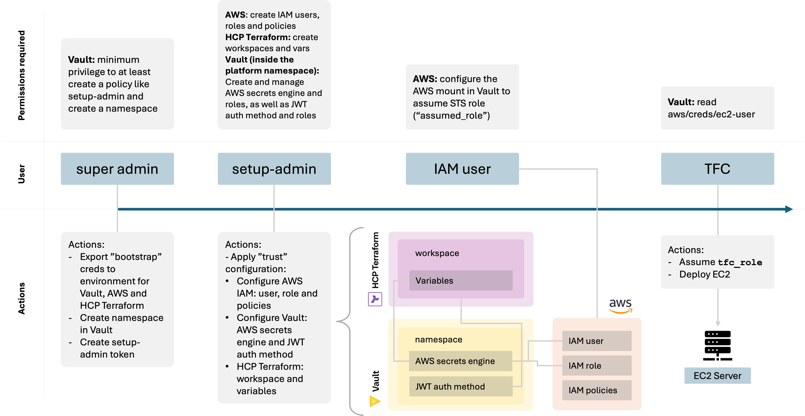

# Vault-Backed dynamic credentials
### Request
> Background: Vault-Backed Dynamic Provider Credentials
> Concern: exploitation point moved to Vault. How can we prevent access to AWS role creation from the privileged Vault user.

The following is a small tutorial using an example I found online with some slight modifications to specifically create a namespace.

## Prerequisites
- Access to a Vault cluster (could be HCP Vault Dedicated) with the permissions to at least create a policy like [this one](/policies/setup-admin.hcl)
- IAM user credentials for AWS (or the equivalent for Azure).
- Access to an HCP Terraform (or TFE) account.

## Example using Terraform
> The following is inspired by [this tutorial](https://developer.hashicorp.com/terraform/cloud-docs/dynamic-provider-credentials/vault-configuration?product_intent=terraform&utm_source=google&utm_medium=sem&utm_content=hashicorp%20iac-161449286394-689680987579&utm_channel_bucket=paid#dynamic-credentials-with-the-vault-provider).

For this example, first you need to run the config inside the [trust](/tf-tutorial/aws/trust/) directory.
For this to work you'll need:
- An appropriate `VAULT_TOKEN` in the env, with the permissions specified in [setup-admin.hcl](policies/setup-admin.hcl)
- "Root" IAM credentials for AWS: `AWS_SECRET_ACCESS_KEY` and `AWS_ACCESS_KEY_ID` - IAM user keys are required because we'll create an IAM user that will assume a role in AWS.
- TFE/C credentials in the env (by running `terraform login`). 

> Note: this example uses HCP Vault Dedicated, in which we create a namespace called 'platform'. We assume that this namespace doesn't exist already as well as a `jwt` auth method in the default path and an `aws` secrets engine also in the default path. Both inside the 'platform' namespace. These will all be created following the instructions below.

This is a little diagram of more or less how this flow works with the required permissions in each step.




## Steps
1. Create the `setup-admin` policy and create a token. This policy is the "least privileged" to perform the necessary actions such as creating the "platform" namespace, enabling and configuring the AWS secrets engine, enabling the `jwt` auth method, etc.

    > NOTE: this policy only allows the setup admin to create an auth method called jwt. No other name is allowed.

    > This first step is done from the perspective of a more privileged user than the "setup admin".

```bash
export VAULT_ADDR=<your vault cluster addr>
export VAULT_TOKEN=<a privileged user token>  #e.g. admin token in HCPV
export VAULT_NAMESPACE=admin #this example uses HCP Vault dedicated

vault namespace create platform
vault policy write setup-admin policies/setup-admin.hcl
vault token create -policy=setup-admin
```

2. Set up the required credentials in the environment:

With the token created above we can continue from the perspective of the "setup user" (which has less privileges than the one before, e.g., _hcp_root_ in HCPV).

You'll need:

- The Vault token created above
- AWS credentials: must have the ability to create other IAM users and policies as specified in [aws.tf](/tf-tutorial/aws/trust/aws.tf)
- Terraform creds

```bash
# Assuming you already exported VAULT_ADDR, NAMESPACE and TOKEN
export AWS_ACCESS_KEY_ID=<your key ID>
export AWS_SECRET_ACCESS_KEY=<your secret key>

# Interactive login to HCP Terraform:
terraform login
```

> NOTE: in this example, the "control workspace" is the local workspace from where we're running Terraform. Ideally this would also be an HCPT workspace, and the 'bootstrap' variables exported to the environment here and in the previous step would be stored as secure vars in HCP Terraform (or TFE).

3. Run the `trust` configuration.

Make sure to first update the `tfvars` file. First copy it:
```bash
cp tf-tutorial/aws/trust/terraform.tfvars.example tf-tutorial/aws/trust/terraform.tfvars
```

And update it with the required variables. In my example I named the AWS role 'ec2-user'.

Now deploy the configs:

```bash
terraform -chdir=tf-tutorial/aws/trust init
terraform -chdir=tf-tutorial/aws/trust apply # -auto-approve
```

4. Check the created configs in HCP Terraform.

After running this first apply you should end up with:
- HCP Terraform: a new workspace in your org with the variables shown below.
- Vault: an aws secrets engine with a configured role, a jwt auth method with a role, a policy attached to the jwt auth method.
- AWS: an IAM user with static credentials whose only allowed action is to assume the `tfe_role` (also created). This role is after attached to the `tfc_policy` which is what the dynamic credentials are created for by Vault.

This is what the variables in the created workspace should look like:


5. Deploy infrastructure in AWS using HCP Terraform

With the appropriate configurations in place you can now proceed to deploy the resources in [infra](/tf-tutorial/aws/infra/) which is essentially an m2.micro EC2 VM with a simple web server that should say "Hello, world!".

Note that at any moment did we configure AWS credentials in the TFE workspace, nor are we using a data source in Terraform to retrieve credentials from Vault. By using the [variables created in the workspace](/tf-tutorial/aws/trust/tfe.tf) we have configured _Vault-backed dynamic credentials_ for that workspace.

In the background HCP Terraform is authenticating to Vault using the created JWT auth method. The role created only has the capability to read the path `aws/sts/ec2-user` to generate dynamic credentials, as you can see in the `tfc-policy` inside [vault.tf](/tf-tutorial/aws/trust/vault.tf).

The `setup-admin` on the other hand, although it has the least privileges to perform all the setup mentioned before still has quite a few permissions. This user may be able to create roles in the `aws` path however it doesn't have access to generating cloud credentials. This is only reserved to the `ec2-user` created in [vault.tf](/tf-tutorial/aws/trust/vault.tf).

This can be tested out by using the token created before (for "setup admin") and running:

```bash
vault read -ns=admin/platform aws/sts/ec2-user  #change for your own role name
```

This will give a permission denied error with this token. However, with a more privileged user token (like an "hcp_root" token) it will successfully generate the dynamic cloud credentials.


### Notes and thoughts:

- The setup-admin policy is more a draft than anything else. It was created (with the assistance of AI, I admit) based on the permissions needed to create the resources in [vault.tf](/tf-tutorial/aws/trust/vault.tf). I'm sure it can be improved and privilege can be reduced further.

- For restricting access even further we could deny the 'setup-admin' the capability of creating roles in AWS. We would give that capability to another user that can exclusively do that and nothing else. This would increase our least privilege posture with the tradeoff of introducing operational overhead.

- Vault-backed dynamic credentials: https://developer.hashicorp.com/terraform/cloud-docs/dynamic-provider-credentials/vault-backed

- When this may come particularly handy: Terraform running locally (either with TF Enterprise or via agents) alongside Vault making an air-gapped environment.